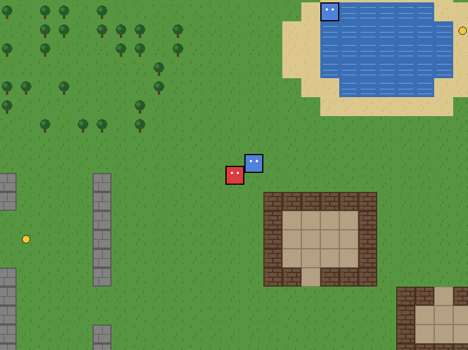

# jjexplore

A tile-based overhead exploration game built with **Pygame**, **pytmx**, and **pyscroll**.

The goal is to build a fun game that doubles as a learning codebase — change the game to learn Python.

**New here? See [LEARNING.md](LEARNING.md)** for a guided tour, suggested first changes, and a map of Python concepts to their locations in the code.



## Project Layout

```
jjexplore/
├── main.py            # Entry point
├── requirements.txt   # Python dependencies
├── plan.md            # Roadmap and design notes
├── src/               # Game source code
│   ├── __init__.py
│   ├── config.py      # Window size, FPS, paths
│   ├── game.py        # Top-level Game class
│   ├── inventory.py   # Inventory + parse_item_spec
│   ├── item.py        # Item pickup sprite
│   ├── audio.py       # SFX + music wrapper around pygame.mixer
│   ├── npc.py         # NPC sprite
│   ├── particle.py    # Particle sprite + pickup-burst helper
│   ├── player.py      # Player sprite (4-direction walk cycle)
│   ├── save.py        # JSON save/load
│   └── tilemap.py     # Loads & renders Tiled .tmx maps via pytmx
├── scripts/           # One-off helpers (asset generators, etc.)
├── assets/            # Sprites, fonts, tileset.png/.tsx, sounds/, music/
├── saves/             # JSON save files (created on first save)
├── maps/              # Tiled .tmx files (incl. overworld.tmx)
└── tests/             # Unit tests (pytest)
```

## Setup

Create and activate a virtual environment, then install dependencies:

```
python -m venv venv
source venv/bin/activate
pip install -r requirements.txt
```

## Run

```
python main.py
```

A title screen opens. Use Up/Down (or W/S) to choose between **New Game**, **Load Game**, and **Quit**. Press Enter (or Space / E) to confirm.

After New Game, you arrive in a 32×24 overworld (1024×768 px) with four regions — forest, lake, canyons, and two small forts — and a grass crossroads in the middle. The **pyscroll** camera follows the player. Move with arrow keys or **WASD** (8-directional, normalized diagonals). Water, trees, canyon stones, and fort walls block movement; collisions resolve per-axis so you slide along walls.

Press **Esc** or **P** during play to open the pause menu (Resume / Save / Load / Title Screen). Saves are stored in `saves/quick.json` and capture the current map, position, inventory, opened chests, and items already picked up.

Walk into the doorway of the **second fort** (south-eastern building) to enter the fort interior — a separate map with a chest and a greeter NPC. Walk south through the fort doorway to return to the overworld. Inventory carries over across maps.

Walk up to a sign, chest, door, NPC, or item and press **E** (or **Space** / **Enter**) to interact. A message box appears at the bottom of the screen — press the same key again to advance / dismiss. NPCs can have multi-page dialog (separate pages with `|` in their `text` property). NPCs block movement and movement pauses while a message is shown.

Items picked up (and chest loot) appear in the inventory panel in the top-right corner. Picking up items and opening chests spawns a small sparkle burst, and stepping into a transition tile fades the screen to black before revealing the next map.

Close the window or press **Esc** to quit.

## Maps

Maps live in `maps/` and use the [Tiled](https://www.mapeditor.org/) `.tmx` format.

- **Install Tiled:** download from <https://www.mapeditor.org/> (Linux: `sudo apt install tiled`, macOS: `brew install --cask tiled`).
- **Edit the existing map:** open `maps/overworld.tmx` in Tiled.
- **Tileset:** `assets/tileset.tsx` (external) plus `assets/tileset.png` (the image). 8 tiles: grass, water, tree, dirt, stone, sand, wall, floor. Water, tree, stone, and wall are marked `blocked=true`.
- **Regenerate the placeholder tileset image:**

  ```
  PYTHONPATH=. python scripts/make_placeholder_tileset.py
  ```

- **Regenerate the maps** (after editing the generator scripts):

  ```
  PYTHONPATH=. python scripts/make_overworld_map.py
  PYTHONPATH=. python scripts/make_fort_interior_map.py
  ```

  The generators are small and readable — tweak forest density, lake size, fort layout, interactable lists, etc. directly in `scripts/make_overworld_map.py` or `scripts/make_fort_interior_map.py`.

- **Regenerate the placeholder sounds + music:**

  ```
  PYTHONPATH=. python scripts/make_placeholder_sounds.py
  ```

  Writes `assets/sounds/*.wav` (pickup, chest, door, transition) and `assets/music/*.wav` (overworld, fort_interior). Music tracks are matched to maps by filename: `<map_stem>.wav` plays automatically when that map loads. To use real audio, drop replacement WAVs into the same folders.

To mark a tile as impassable, give it a custom property `blocked` (bool) `true` in Tiled (or in `tileset.tsx`). `TileMap` picks these up as collision rects automatically.

### Interactables

Interactable objects (signs, chests, doors, NPCs, items) live on an object layer named `interact` in the `.tmx`. Each object's Tiled `type` is one of `sign`, `chest`, `door`, `npc`, or `item`. Custom properties:

- `text` — message displayed when the player interacts. NPC dialog can have multiple pages — separate them with `|`.
- `item` — item spec `name` or `name:count`, added to the player's inventory on pickup (for `item`) or open (for `chest`).
- `target_map`, `target_tx`, `target_ty` — used by `transition` objects. Walking onto a transition tile loads the target map (file in `maps/`) and respawns the player at the target tile.

To add or edit interactables, modify the `INTERACTABLES` list in `scripts/make_overworld_map.py` and regenerate, or place objects directly in Tiled.

## Run Tests

```
pytest
```

In headless environments (CI, no display), prefix with `SDL_VIDEODRIVER=dummy`.

## Controls

| Key                       | Action                                |
| ------------------------- | ------------------------------------- |
| Arrow keys / WASD         | Move player (or navigate menus)       |
| E / Space / Enter         | Interact, advance dialog, or activate |
| Esc / P                   | Pause (menu) / quit (from title)      |
| M                         | Mute / unmute audio                   |

## Developer Guide

Treat the roadmap in `plan.md` as the source of truth for what to build next.

**With every roadmap step you complete:**

1. **Update `README.md`.** Reflect any new layout, dependencies, run instructions, controls, or features. New folders go in the Project Layout section. New commands go under Setup/Run.
2. **Update `plan.md`.** Check off the completed top-level item, mark sub-items done, and add new sub-items as the design clarifies.
3. **Add or update unit tests.** Anything pure (no display, no input, no filesystem-state) should have a test. Aim for: parsing, math, collision logic, state transitions, config validation. Skip: rendering, audio playback, raw Pygame surface output.
4. **Run `pytest` and confirm green** before considering the step done.

This rhythm is what makes the codebase a good learning environment — a beginner editing a function should immediately see the test confirm or contradict their change.
